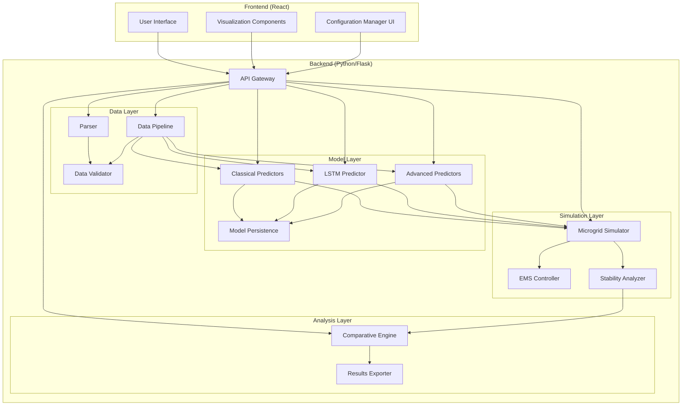

# Design Document: Microgrid Stability Enhancement

## Overview

This document specifies the technical design for transforming a monolithic Python/tkinter microgrid stability prediction application into a modern, scalable Frontend-Backend architecture with enhanced analytical capabilities.

### System Purpose

The enhanced system enables researchers and microgrid operators to:
- Compare multiple PV forecasting methods (Classical, LSTM, Advanced deep learning)
- Quantify the impact of forecast accuracy on microgrid stability
- Configure realistic microgrid topologies and operating modes
- Analyze comprehensive stability metrics (frequency, voltage, battery stress, power quality)
- Export results for publications and further analysis

### Key Design Principles

1. **Separation of Concerns**: Frontend handles UI/visualization, Backend handles computation/ML
2. **Extensibility**: Plugin architecture for adding new prediction models
3. **Reproducibility**: Configuration-driven experiments with full parameter tracking
4. **Performance**: Efficient data pipelines and simulation engines for rapid iteration
5. **Testability**: Property-based testing for correctness guarantees


## Architecture

### High-Level Architecture




### Technology Stack

#### Frontend
- **Framework**: React 18+ with TypeScript
- **State Management**: React Context API or Zustand (lightweight)
- **Visualization**: Recharts or Plotly.js for interactive time-series plots
- **HTTP Client**: Axios for API communication
- **Build Tool**: Vite for fast development and optimized builds
- **Styling**: Tailwind CSS for responsive design

#### Backend
- **Framework**: Flask 3.0+ with Flask-RESTful for API endpoints
- **ML Framework**: PyTorch 2.0+ for deep learning models
- **Classical ML**: scikit-learn for ARIMA, SVR, and preprocessing
- **Data Processing**: pandas, NumPy for data manipulation
- **Validation**: Pydantic for request/response validation
- **Task Queue**: Celery with Redis for long-running training jobs (optional for v1)
- **Model Serving**: TorchServe or custom inference endpoints

#### Data Storage
- **Configuration**: JSON files for experiment configurations
- **Models**: PyTorch .pt files with metadata JSON
- **Results**: CSV for time-series, JSON for metrics
- **Cache**: Redis for API response caching (optional)

#### Development & Testing
- **Backend Testing**: pytest, pytest-cov, Hypothesis (property-based testing)
- **Frontend Testing**: Vitest, React Testing Library
- **API Testing**: pytest with requests library
- **Linting**: ESLint (frontend), Ruff/Black (backend)
- **Type Checking**: TypeScript (frontend), mypy (backend)


### Directory Structure

```
microgrid-stability-enhancement/
├── frontend/
│   ├── src/
│   │   ├── components/
│   │   │   ├── ConfigurationPanel.tsx
│   │   │   ├── VisualizationDashboard.tsx
│   │   │   ├── MetricsTable.tsx
│   │   │   ├── TimeSeriesChart.tsx
│   │   │   └── ModelComparison.tsx
│   │   ├── services/
│   │   │   └── api.ts
│   │   ├── types/
│   │   │   └── models.ts
│   │   ├── App.tsx
│   │   └── main.tsx
│   ├── package.json
│   ├── tsconfig.json
│   └── vite.config.ts
│
├── backend/
│   ├── src/
│   │   ├── api/
│   │   │   ├── __init__.py
│   │   │   ├── routes.py
│   │   │   └── schemas.py
│   │   ├── data/
│   │   │   ├── __init__.py
│   │   │   ├── parser.py
│   │   │   ├── pipeline.py
│   │   │   ├── validator.py
│   │   │   └── generator.py
│   │   ├── models/
│   │   │   ├── __init__.py
│   │   │   ├── base.py
│   │   │   ├── classical.py
│   │   │   ├── lstm.py
│   │   │   ├── advanced.py
│   │   │   └── persistence.py
│   │   ├── simulation/
│   │   │   ├── __init__.py
│   │   │   ├── simulator.py
│   │   │   ├── ems_controller.py
│   │   │   └── stability_analyzer.py
│   │   ├── analysis/
│   │   │   ├── __init__.py
│   │   │   ├── comparative_engine.py
│   │   │   └── results_exporter.py
│   │   ├── config/
│   │   │   ├── __init__.py
│   │   │   └── manager.py
│   │   └── app.py
│   ├── tests/
│   │   ├── unit/
│   │   ├── integration/
│   │   └── property/
│   ├── requirements.txt
│   └── setup.py
│
├── configs/
│   └── example_config.json
├── models/
│   └── saved_models/
├── results/
│   └── exports/
└── README.md
```


## Components and Interfaces

### Data Layer Components

#### Parser

**Purpose**: Parse and validate configuration files and input data formats.

**Interface**:
```python
class Parser:
    def parse_config(self, config_path: str) -> Configuration:
        """Parse JSON configuration file into Configuration object"""
        
    def parse_timeseries_data(self, data_path: str, format: str) -> pd.DataFrame:
        """Parse time-series data from CSV or other formats"""
        
    def validate_config(self, config: Configuration) -> ValidationResult:
        """Validate configuration object against schema"""
```

**Key Responsibilities**:
- Parse JSON configuration files
- Validate configuration schema using Pydantic
- Parse CSV/Excel time-series data
- Handle encoding and format variations
- Return descriptive error messages for invalid inputs

**Error Handling**:
- Raise `ConfigurationError` for invalid configurations
- Raise `DataFormatError` for unparseable data files
- Include line numbers and field names in error messages


#### Data Pipeline

**Purpose**: Preprocess, normalize, and prepare data for model training and simulation.

**Interface**:
```python
class DataPipeline:
    def __init__(self, config: Configuration):
        self.config = config
        self.scaler = None
        
    def preprocess(self, df: pd.DataFrame) -> pd.DataFrame:
        """Clean and preprocess raw data"""
        
    def normalize(self, df: pd.DataFrame) -> Tuple[np.ndarray, Scaler]:
        """Normalize features to [0, 1] range"""
        
    def create_sequences(self, data: np.ndarray, 
                        sequence_length: int) -> Tuple[np.ndarray, np.ndarray]:
        """Create input sequences for time-series models"""
        
    def engineer_features(self, df: pd.DataFrame) -> pd.DataFrame:
        """Create lagged features and temporal encodings"""
        
    def split_data(self, X: np.ndarray, y: np.ndarray, 
                   train_ratio: float = 0.8) -> DataSplit:
        """Split data into train/test sets"""
```

**Key Responsibilities**:
- Handle missing values (forward-fill, interpolation)
- Normalize features using MinMaxScaler or StandardScaler
- Create lagged features for temporal context
- Generate sequences for LSTM/RNN models
- Split data maintaining temporal order
- Validate data quality and issue warnings

**Data Flow**:
1. Raw DataFrame → Validation
2. Validation → Missing value handling
3. Missing value handling → Feature engineering
4. Feature engineering → Normalization
5. Normalization → Sequence creation
6. Sequence creation → Train/test split


#### Data Validator

**Purpose**: Validate data quality and physical plausibility.

**Interface**:
```python
class DataValidator:
    def validate_timeseries(self, df: pd.DataFrame) -> ValidationReport:
        """Validate time-series data quality"""
        
    def check_missing_values(self, df: pd.DataFrame) -> MissingValueReport:
        """Check for missing values and gaps"""
        
    def check_outliers(self, df: pd.DataFrame) -> OutlierReport:
        """Detect statistical outliers"""
        
    def check_physical_constraints(self, df: pd.DataFrame) -> ConstraintReport:
        """Validate physical plausibility of values"""
```

**Validation Rules**:
- PV power: 0 ≤ pv_power ≤ array_capacity
- Irradiance: 0 ≤ irradiance ≤ 1.2 kW/m²
- Temperature: -50°C ≤ temperature ≤ 60°C
- Missing values: < 10% of dataset
- Timestamp gaps: No gaps > 10% of expected resolution
- Outliers: Values beyond 3 standard deviations flagged

**Output**:
- Critical errors: Reject data
- Warnings: Allow processing but log issues
- Info: Statistics about data quality


### Model Layer Components

#### Base Predictor (Abstract)

**Purpose**: Define common interface for all prediction models.

**Interface**:
```python
from abc import ABC, abstractmethod

class BasePredictor(ABC):
    def __init__(self, config: ModelConfig):
        self.config = config
        self.model = None
        self.scaler = None
        self.metadata = {}
        
    @abstractmethod
    def build_model(self) -> None:
        """Build the prediction model architecture"""
        
    @abstractmethod
    def train(self, X_train: np.ndarray, y_train: np.ndarray, 
              X_val: np.ndarray, y_val: np.ndarray) -> TrainingResult:
        """Train the model and return training metrics"""
        
    @abstractmethod
    def predict(self, X: np.ndarray) -> np.ndarray:
        """Generate predictions for input data"""
        
    def evaluate(self, y_true: np.ndarray, y_pred: np.ndarray) -> MetricsDict:
        """Calculate prediction metrics (MAE, RMSE, MAPE, R²)"""
        
    def save(self, path: str) -> None:
        """Save model weights and metadata"""
        
    def load(self, path: str) -> None:
        """Load model weights and metadata"""
```

**Common Functionality**:
- Metric calculation (MAE, RMSE, MAPE, R²)
- Model persistence (save/load)
- Metadata tracking (hyperparameters, training time, version)
- Input validation


#### Classical Predictors

**Purpose**: Implement traditional forecasting methods.

**Models**:
1. **Persistence**: Naive forecast (next value = current value)
2. **ARIMA**: Auto-Regressive Integrated Moving Average
3. **SVR**: Support Vector Regression with RBF kernel

**Interface**:
```python
class ClassicalPredictor(BasePredictor):
    def __init__(self, config: ModelConfig, method: str):
        super().__init__(config)
        self.method = method  # 'persistence', 'arima', 'svr'
        
    def build_model(self) -> None:
        if self.method == 'persistence':
            self.model = PersistenceModel()
        elif self.method == 'arima':
            self.model = ARIMA(order=(5, 1, 0))
        elif self.method == 'svr':
            self.model = SVR(kernel='rbf', C=1.0, epsilon=0.1)
```

**Hyperparameters**:
- ARIMA: order (p, d, q), seasonal order
- SVR: C (regularization), epsilon (tube width), kernel parameters

**Training**:
- Persistence: No training required
- ARIMA: Fit using statsmodels
- SVR: Fit using scikit-learn


#### LSTM Predictor

**Purpose**: Baseline deep learning model for time-series forecasting.

**Architecture**:
```python
class LSTMModel(nn.Module):
    def __init__(self, input_size: int, hidden_size: int, 
                 num_layers: int, dropout: float):
        super().__init__()
        self.lstm = nn.LSTM(
            input_size=input_size,
            hidden_size=hidden_size,
            num_layers=num_layers,
            dropout=dropout,
            batch_first=True
        )
        self.fc = nn.Linear(hidden_size, 1)
        
    def forward(self, x):
        lstm_out, _ = self.lstm(x)
        output = self.fc(lstm_out[:, -1, :])
        return output
```

**Hyperparameters**:
- input_size: Number of features (5-10 depending on available weather data)
- hidden_size: 32-128 (configurable)
- num_layers: 1-3
- dropout: 0.1-0.3
- learning_rate: 0.001-0.01
- batch_size: 32-128
- epochs: 30-100

**Training Strategy**:
- Optimizer: Adam
- Loss: MSE (Mean Squared Error)
- Early stopping: Monitor validation loss
- Learning rate scheduling: ReduceLROnPlateau

**Input Shape**: (batch_size, sequence_length, num_features)
**Output Shape**: (batch_size, 1)


#### Advanced Predictors

**Purpose**: State-of-the-art deep learning architectures.

**Models**:

1. **GRU (Gated Recurrent Unit)**:
```python
class GRUModel(nn.Module):
    def __init__(self, input_size, hidden_size, num_layers):
        super().__init__()
        self.gru = nn.GRU(input_size, hidden_size, num_layers, 
                          batch_first=True)
        self.fc = nn.Linear(hidden_size, 1)
```

2. **CNN-LSTM (Convolutional + LSTM)**:
```python
class CNNLSTMModel(nn.Module):
    def __init__(self, input_size, hidden_size):
        super().__init__()
        self.conv1 = nn.Conv1d(input_size, 64, kernel_size=3, padding=1)
        self.conv2 = nn.Conv1d(64, 32, kernel_size=3, padding=1)
        self.lstm = nn.LSTM(32, hidden_size, batch_first=True)
        self.fc = nn.Linear(hidden_size, 1)
```

3. **Transformer**:
```python
class TransformerModel(nn.Module):
    def __init__(self, input_size, d_model, nhead, num_layers):
        super().__init__()
        self.embedding = nn.Linear(input_size, d_model)
        encoder_layer = nn.TransformerEncoderLayer(
            d_model=d_model, nhead=nhead, batch_first=True
        )
        self.transformer = nn.TransformerEncoder(encoder_layer, num_layers)
        self.fc = nn.Linear(d_model, 1)
```

**Rationale**:
- GRU: Faster training than LSTM, similar performance
- CNN-LSTM: Captures local patterns + temporal dependencies
- Transformer: Attention mechanism for long-range dependencies


#### Model Persistence

**Purpose**: Save and load trained models with metadata.

**Storage Format**:
```
models/saved_models/{model_id}/
├── model.pt              # PyTorch state dict
├── scaler.pkl            # Fitted scaler object
├── metadata.json         # Model configuration and metrics
└── training_history.json # Loss curves and training logs
```

**Metadata Schema**:
```json
{
  "model_id": "lstm_20240115_143022",
  "model_type": "lstm",
  "architecture": {
    "input_size": 5,
    "hidden_size": 64,
    "num_layers": 2,
    "dropout": 0.2
  },
  "training": {
    "epochs": 50,
    "batch_size": 64,
    "learning_rate": 0.001,
    "train_samples": 8640,
    "val_samples": 2160
  },
  "metrics": {
    "train_loss": 0.0234,
    "val_loss": 0.0289,
    "mae": 0.0456,
    "rmse": 0.0623,
    "r2": 0.8912
  },
  "data_info": {
    "sequence_length": 12,
    "forecast_horizon": "15min",
    "features": ["irradiance", "temperature", "cloud_cover", "humidity", "wind_speed"]
  },
  "created_at": "2024-01-15T14:30:22Z",
  "framework_version": "pytorch-2.0.1"
}
```


### Simulation Layer Components

#### Microgrid Simulator

**Purpose**: Physics-based simulation of microgrid component interactions.

**Interface**:
```python
class MicrogridSimulator:
    def __init__(self, config: MicrogridConfig):
        self.config = config
        self.components = self._initialize_components()
        
    def simulate(self, pv_forecast: np.ndarray, 
                 actual_pv: np.ndarray,
                 load_profile: np.ndarray,
                 timestep_seconds: int = 60) -> SimulationResult:
        """Run microgrid simulation"""
        
    def _initialize_components(self) -> Dict[str, Component]:
        """Initialize PV, battery, inverter, generator components"""
        
    def _calculate_power_balance(self, t: int) -> PowerBalance:
        """Calculate power balance at timestep t"""
        
    def _update_battery_state(self, power: float, dt: float) -> None:
        """Update battery SOC based on charge/discharge"""
        
    def _calculate_frequency_deviation(self, power_imbalance: float) -> float:
        """Calculate frequency deviation from power imbalance"""
        
    def _calculate_voltage_deviation(self, reactive_power: float) -> float:
        """Calculate voltage deviation from reactive power"""
```

**Component Models**:

1. **PV Array**:
```python
class PVArray:
    def calculate_output(self, irradiance: float, temperature: float) -> float:
        """
        P_pv = irradiance * area * efficiency * temp_coefficient
        temp_coefficient = 1 - 0.004 * (T - 25)
        """
```

2. **Battery (BESS)**:
```python
class Battery:
    def charge(self, power: float, dt: float) -> float:
        """
        SOC_new = SOC + (power * dt * charge_efficiency) / capacity
        Constraints: 0 ≤ SOC ≤ capacity, |power| ≤ max_power
        """
        
    def discharge(self, power: float, dt: float) -> float:
        """
        SOC_new = SOC - (power * dt / discharge_efficiency) / capacity
        """
```

3. **Inverter**:
```python
class Inverter:
    def convert(self, dc_power: float) -> Tuple[float, float]:
        """
        ac_power = dc_power * efficiency_curve(dc_power)
        reactive_power = ac_power * tan(acos(power_factor))
        """
```


**Physics Models**:

1. **Frequency Dynamics**:
```
Δf = (P_gen - P_load) / (2 * H * S_base) * f_nominal
where:
  H = system inertia constant (seconds)
  S_base = base power (kW)
  f_nominal = 50 or 60 Hz
```

2. **Voltage Dynamics**:
```
ΔV = (Q_gen - Q_load) * X / V_nominal
where:
  X = system reactance
  V_nominal = nominal voltage
```

3. **Battery Dynamics**:
```
SOC(t+1) = SOC(t) + (P_batt * Δt * η) / E_capacity
Constraints:
  SOC_min ≤ SOC ≤ SOC_max
  P_min ≤ P_batt ≤ P_max
  η = η_charge if P_batt > 0 else 1/η_discharge
```

**Operating Modes**:
- **Grid-Connected**: Can import/export power, grid provides frequency/voltage support
- **Islanded**: No grid connection, must maintain frequency/voltage internally
- **Hybrid AC/DC**: Separate AC and DC buses with bidirectional converter


#### EMS Controller

**Purpose**: Optimize battery dispatch using forecasts to minimize stability deviations.

**Interface**:
```python
class EMSController:
    def __init__(self, config: EMSConfig, strategy: str = 'mpc'):
        self.config = config
        self.strategy = strategy  # 'mpc', 'rule_based', 'reactive'
        
    def compute_dispatch(self, 
                        current_state: SystemState,
                        forecast: np.ndarray,
                        horizon: int) -> np.ndarray:
        """Compute optimal battery dispatch over horizon"""
        
    def _mpc_optimization(self, state: SystemState, 
                         forecast: np.ndarray) -> np.ndarray:
        """Model Predictive Control optimization"""
        
    def _rule_based_control(self, state: SystemState, 
                           forecast: np.ndarray) -> float:
        """Rule-based control logic"""
```

**Control Strategies**:

1. **Model Predictive Control (MPC)**:
```python
# Optimization problem:
minimize: Σ(|Δf_t|² + |ΔV_t|² + λ * |P_batt_t|²)
subject to:
  SOC_min ≤ SOC_t ≤ SOC_max
  P_min ≤ P_batt_t ≤ P_max
  SOC_t+1 = SOC_t + P_batt_t * Δt * η / E_cap
  Δf_t = f(P_pv_forecast_t - P_load_t + P_batt_t)
```

2. **Rule-Based Control**:
```python
if forecast_surplus > threshold:
    charge_battery()
elif forecast_deficit > threshold:
    discharge_battery()
else:
    maintain_soc()
```

3. **Reactive Control** (baseline):
```python
# No forecast, react to current imbalance
P_batt = -(P_pv_actual - P_load)
```

**Optimization Solver**: scipy.optimize.minimize or CVXPY for convex problems


#### Stability Analyzer

**Purpose**: Calculate comprehensive stability and performance metrics.

**Interface**:
```python
class StabilityAnalyzer:
    def analyze(self, sim_result: SimulationResult) -> StabilityMetrics:
        """Calculate all stability metrics"""
        
    def frequency_metrics(self, freq_deviation: np.ndarray) -> FrequencyMetrics:
        """Calculate frequency-related metrics"""
        
    def voltage_metrics(self, voltage_deviation: np.ndarray) -> VoltageMetrics:
        """Calculate voltage-related metrics"""
        
    def battery_stress_metrics(self, soc: np.ndarray, 
                               power: np.ndarray) -> BatteryMetrics:
        """Calculate battery stress metrics"""
        
    def power_quality_metrics(self, sim_result: SimulationResult) -> PowerQualityMetrics:
        """Calculate power quality metrics"""
        
    def energy_balance_metrics(self, sim_result: SimulationResult) -> EnergyMetrics:
        """Calculate energy imbalance metrics"""
```

**Metrics Definitions**:

1. **Frequency Metrics**:
```python
{
  "mean_absolute_deviation": np.mean(np.abs(freq_deviation)),
  "std_deviation": np.std(freq_deviation),
  "max_deviation": np.max(np.abs(freq_deviation)),
  "time_outside_limits": np.sum(np.abs(freq_deviation) > 0.5) / len(freq_deviation),
  "rate_of_change": np.mean(np.abs(np.diff(freq_deviation)))
}
```

2. **Voltage Metrics**:
```python
{
  "mean_absolute_deviation": np.mean(np.abs(voltage_deviation)),
  "std_deviation": np.std(voltage_deviation),
  "max_deviation": np.max(np.abs(voltage_deviation)),
  "time_outside_limits": np.sum(np.abs(voltage_deviation) > 10) / len(voltage_deviation)
}
```

3. **Battery Stress Metrics**:
```python
{
  "soc_range": np.max(soc) - np.min(soc),
  "num_cycles": count_charge_discharge_cycles(power),
  "max_depth_of_discharge": 1.0 - np.min(soc) / capacity,
  "avg_c_rate": np.mean(np.abs(power)) / capacity,
  "total_throughput": np.sum(np.abs(power)) * dt
}
```

4. **Power Quality Metrics**:
```python
{
  "thd_proxy": calculate_harmonic_distortion(power_signal),
  "power_factor": np.mean(active_power / apparent_power)
}
```

5. **Energy Balance Metrics**:
```python
{
  "total_unmet_load": np.sum(np.maximum(0, load - pv - battery)),
  "total_curtailed_pv": np.sum(np.maximum(0, pv - load - battery_capacity)),
  "energy_efficiency": delivered_energy / generated_energy
}
```


### Analysis Layer Components

#### Comparative Engine

**Purpose**: Execute and compare multiple forecasting approaches systematically.

**Interface**:
```python
class ComparativeEngine:
    def __init__(self, config: ComparisonConfig):
        self.config = config
        self.results = {}
        
    def run_comparison(self, 
                      models: List[BasePredictor],
                      test_data: np.ndarray,
                      microgrid_config: MicrogridConfig) -> ComparisonResult:
        """Run all models and compare results"""
        
    def _run_single_model(self, model: BasePredictor, 
                         test_data: np.ndarray) -> ModelResult:
        """Run single model and simulation"""
        
    def calculate_improvements(self, baseline: str = 'no_forecast') -> ImprovementMetrics:
        """Calculate percentage improvements over baseline"""
        
    def rank_models(self, metric: str) -> List[Tuple[str, float]]:
        """Rank models by specified metric"""
        
    def statistical_significance(self, model_a: str, 
                                 model_b: str) -> SignificanceTest:
        """Perform statistical test comparing two models"""
```

**Comparison Workflow**:
1. Load all specified models
2. Generate predictions on identical test set
3. Run microgrid simulations with each forecast
4. Calculate prediction and stability metrics
5. Compute relative improvements
6. Generate comparison tables and visualizations
7. Perform statistical significance tests

**Output Format**:
```python
{
  "models": {
    "no_forecast": {...},
    "persistence": {...},
    "arima": {...},
    "lstm": {...},
    "gru": {...},
    "transformer": {...}
  },
  "rankings": {
    "mae": ["transformer", "gru", "lstm", ...],
    "freq_stability": ["lstm", "transformer", "gru", ...],
    "battery_stress": ["gru", "lstm", "transformer", ...]
  },
  "improvements": {
    "lstm": {
      "mae_improvement": -45.2,  # % vs no_forecast
      "freq_std_improvement": 32.1,
      "battery_cycles_reduction": 18.5
    },
    ...
  }
}
```


#### Results Exporter

**Purpose**: Format and export analysis results in multiple formats.

**Interface**:
```python
class ResultsExporter:
    def __init__(self, output_dir: str):
        self.output_dir = output_dir
        
    def export_timeseries(self, data: Dict[str, np.ndarray], 
                         filename: str, format: str = 'csv') -> str:
        """Export time-series data"""
        
    def export_metrics(self, metrics: Dict, 
                      filename: str, format: str = 'json') -> str:
        """Export metrics tables"""
        
    def export_visualizations(self, figures: List[plt.Figure], 
                             prefix: str) -> List[str]:
        """Export plots as PNG/SVG"""
        
    def export_configuration(self, config: Configuration, 
                            filename: str) -> str:
        """Export configuration for reproducibility"""
        
    def generate_report(self, comparison_result: ComparisonResult, 
                       format: str = 'markdown') -> str:
        """Generate comprehensive analysis report"""
```

**Export Formats**:

1. **Time-Series CSV**:
```csv
timestamp,actual_pv,predicted_pv,load,soc_no_forecast,soc_forecast,freq_dev_no_forecast,freq_dev_forecast
2024-01-15 00:00:00,0.0,0.0,0.45,2.5,2.5,0.0,0.0
2024-01-15 00:15:00,0.0,0.0,0.43,2.48,2.49,0.02,0.01
...
```

2. **Metrics JSON**:
```json
{
  "prediction_metrics": {
    "mae": 0.0456,
    "rmse": 0.0623,
    "mape": 12.34,
    "r2": 0.8912
  },
  "stability_metrics": {
    "frequency": {...},
    "voltage": {...},
    "battery": {...}
  }
}
```

3. **Summary Report (Markdown)**:
```markdown
# Microgrid Stability Analysis Report

## Configuration
- Forecast Horizon: 15 minutes
- Battery Capacity: 5.0 kWh
- Microgrid Mode: Islanded
- Model: LSTM (64 hidden units, 2 layers)

## Prediction Performance
| Metric | Value |
|--------|-------|
| MAE    | 0.0456 |
| RMSE   | 0.0623 |
| R²     | 0.8912 |

## Stability Improvements
| Metric | No Forecast | With Forecast | Improvement |
|--------|-------------|---------------|-------------|
| Freq STD | 0.234 Hz | 0.156 Hz | 33.3% |
| Battery Cycles | 12.5 | 9.8 | 21.6% |
...
```


## Data Models

### Configuration Schema

```python
from pydantic import BaseModel, Field, validator
from typing import List, Optional, Literal
from enum import Enum

class ForecastHorizon(str, Enum):
    FIVE_MIN = "5min"
    FIFTEEN_MIN = "15min"
    ONE_HOUR = "1hour"

class MicrogridMode(str, Enum):
    GRID_CONNECTED = "grid_connected"
    ISLANDED = "islanded"
    HYBRID = "hybrid_ac_dc"

class ModelType(str, Enum):
    PERSISTENCE = "persistence"
    ARIMA = "arima"
    SVR = "svr"
    LSTM = "lstm"
    GRU = "gru"
    CNN_LSTM = "cnn_lstm"
    TRANSFORMER = "transformer"

class ModelConfig(BaseModel):
    model_type: ModelType
    hyperparameters: dict = Field(default_factory=dict)
    sequence_length: int = Field(default=12, ge=4, le=48)
    
class MicrogridConfig(BaseModel):
    mode: MicrogridMode
    pv_capacity_kw: float = Field(gt=0)
    battery_capacity_kwh: float = Field(gt=0)
    battery_power_kw: float = Field(gt=0)
    inverter_capacity_kw: float = Field(gt=0)
    initial_soc_kwh: Optional[float] = None
    has_diesel_generator: bool = False
    diesel_capacity_kw: Optional[float] = None
    
    @validator('inverter_capacity_kw')
    def inverter_must_exceed_pv(cls, v, values):
        if 'pv_capacity_kw' in values and v < values['pv_capacity_kw']:
            raise ValueError('Inverter capacity must be >= PV capacity')
        return v

class TrainingConfig(BaseModel):
    epochs: int = Field(default=50, ge=10, le=500)
    batch_size: int = Field(default=64, ge=16, le=512)
    learning_rate: float = Field(default=0.001, gt=0, lt=1)
    validation_split: float = Field(default=0.2, gt=0, lt=0.5)
    early_stopping_patience: int = Field(default=10, ge=3)

class Configuration(BaseModel):
    experiment_name: str
    forecast_horizon: ForecastHorizon
    model_config: ModelConfig
    microgrid_config: MicrogridConfig
    training_config: TrainingConfig
    data_path: str
    output_dir: str = "results"
```


### API Request/Response Schemas

```python
# Training Request
class TrainRequest(BaseModel):
    config: Configuration
    data: Optional[dict] = None  # Can upload data or reference path

# Training Response
class TrainResponse(BaseModel):
    job_id: str
    status: Literal["queued", "running", "completed", "failed"]
    message: str

# Training Status Response
class TrainingStatus(BaseModel):
    job_id: str
    status: Literal["queued", "running", "completed", "failed"]
    progress: float  # 0.0 to 1.0
    current_epoch: Optional[int]
    metrics: Optional[dict]
    error: Optional[str]

# Prediction Request
class PredictRequest(BaseModel):
    model_id: str
    input_data: List[List[float]]  # Shape: (samples, features)
    
# Prediction Response
class PredictResponse(BaseModel):
    predictions: List[float]
    confidence_intervals: Optional[List[Tuple[float, float]]]

# Simulation Request
class SimulateRequest(BaseModel):
    predictions: List[float]
    actual_pv: List[float]
    load_profile: List[float]
    microgrid_config: MicrogridConfig
    
# Simulation Response
class SimulationResponse(BaseModel):
    result_id: str
    timeseries: dict  # SOC, frequency, voltage over time
    metrics: dict     # Stability metrics
    
# Comparison Request
class CompareRequest(BaseModel):
    model_ids: List[str]
    test_data_path: str
    microgrid_config: MicrogridConfig
    
# Comparison Response
class ComparisonResponse(BaseModel):
    comparison_id: str
    results: dict
    rankings: dict
    improvements: dict
```


## API Design

### REST API Endpoints

#### Training Endpoints

**POST /api/train**
- Description: Start model training job
- Request Body: `TrainRequest`
- Response: `TrainResponse` (202 Accepted)
- Example:
```json
{
  "config": {
    "experiment_name": "lstm_baseline",
    "forecast_horizon": "15min",
    "model_config": {
      "model_type": "lstm",
      "hyperparameters": {"hidden_size": 64, "num_layers": 2},
      "sequence_length": 12
    },
    "microgrid_config": {...},
    "training_config": {...},
    "data_path": "data/solar_data.csv"
  }
}
```

**GET /api/train/{job_id}/status**
- Description: Get training job status and progress
- Response: `TrainingStatus` (200 OK)
- Example Response:
```json
{
  "job_id": "train_abc123",
  "status": "running",
  "progress": 0.65,
  "current_epoch": 33,
  "metrics": {
    "train_loss": 0.0234,
    "val_loss": 0.0289
  }
}
```

**DELETE /api/train/{job_id}**
- Description: Cancel running training job
- Response: 204 No Content


#### Model Management Endpoints

**GET /api/models**
- Description: List all available trained models
- Query Parameters: 
  - `model_type` (optional): Filter by model type
  - `sort_by` (optional): Sort by 'created_at', 'mae', 'rmse'
- Response: List of model metadata (200 OK)
- Example Response:
```json
{
  "models": [
    {
      "model_id": "lstm_20240115_143022",
      "model_type": "lstm",
      "created_at": "2024-01-15T14:30:22Z",
      "metrics": {"mae": 0.0456, "rmse": 0.0623, "r2": 0.8912}
    },
    ...
  ]
}
```

**GET /api/models/{model_id}**
- Description: Get detailed model information
- Response: Full model metadata (200 OK)

**DELETE /api/models/{model_id}**
- Description: Delete saved model
- Response: 204 No Content

**POST /api/models/{model_id}/load**
- Description: Load model into memory for inference
- Response: 200 OK


#### Prediction Endpoints

**POST /api/predict**
- Description: Generate predictions using trained model
- Request Body: `PredictRequest`
- Response: `PredictResponse` (200 OK)
- Example Request:
```json
{
  "model_id": "lstm_20240115_143022",
  "input_data": [
    [0.8, 28.5, 0.3, 0.65, 3.2],  // [irradiance, temp, cloud, humidity, wind]
    [0.82, 29.1, 0.25, 0.62, 3.5],
    ...
  ]
}
```
- Example Response:
```json
{
  "predictions": [0.756, 0.768, 0.781, ...],
  "confidence_intervals": [[0.72, 0.79], [0.73, 0.81], ...]
}
```

#### Simulation Endpoints

**POST /api/simulate**
- Description: Run microgrid simulation
- Request Body: `SimulateRequest`
- Response: `SimulationResponse` (200 OK)
- Example Request:
```json
{
  "predictions": [0.5, 0.6, 0.7, ...],
  "actual_pv": [0.48, 0.62, 0.68, ...],
  "load_profile": [0.45, 0.46, 0.47, ...],
  "microgrid_config": {
    "mode": "islanded",
    "pv_capacity_kw": 10.0,
    "battery_capacity_kwh": 5.0,
    "battery_power_kw": 3.0,
    "inverter_capacity_kw": 12.0
  }
}
```


#### Comparison Endpoints

**POST /api/compare**
- Description: Run comparative analysis across multiple models
- Request Body: `CompareRequest`
- Response: `ComparisonResponse` (202 Accepted)
- Example Request:
```json
{
  "model_ids": ["persistence", "arima_001", "lstm_20240115", "gru_20240116"],
  "test_data_path": "data/test_set.csv",
  "microgrid_config": {...}
}
```

**GET /api/compare/{comparison_id}/status**
- Description: Get comparison job status
- Response: Status and progress (200 OK)

**GET /api/compare/{comparison_id}/results**
- Description: Get comparison results
- Response: Full comparison results (200 OK)

#### Export Endpoints

**GET /api/export/{result_id}**
- Description: Download exported results
- Query Parameters:
  - `format`: 'csv', 'json', 'markdown', 'pdf'
  - `include`: 'timeseries', 'metrics', 'plots', 'config', 'all'
- Response: ZIP file with requested artifacts (200 OK)

**POST /api/export/custom**
- Description: Create custom export with specific data
- Request Body: Export configuration
- Response: Download link (200 OK)


#### Data Management Endpoints

**POST /api/data/upload**
- Description: Upload time-series data
- Request: Multipart form data with CSV file
- Response: Data ID and validation report (200 OK)

**POST /api/data/validate**
- Description: Validate data quality
- Request Body: Data path or uploaded data ID
- Response: Validation report (200 OK)
- Example Response:
```json
{
  "valid": true,
  "warnings": [
    "3 outliers detected in irradiance column",
    "0.5% missing values in temperature column"
  ],
  "errors": [],
  "statistics": {
    "num_samples": 8640,
    "date_range": ["2024-01-01", "2024-01-30"],
    "resolution": "5min",
    "features": ["irradiance", "temperature", "cloud_cover", "humidity", "wind_speed"]
  }
}
```

**GET /api/data/{data_id}**
- Description: Get data metadata
- Response: Data information (200 OK)

### Error Responses

All endpoints follow consistent error response format:

```json
{
  "error": {
    "code": "INVALID_CONFIG",
    "message": "Inverter capacity must be >= PV capacity",
    "details": {
      "field": "microgrid_config.inverter_capacity_kw",
      "provided": 8.0,
      "required": ">= 10.0"
    }
  }
}
```

**HTTP Status Codes**:
- 200: Success
- 202: Accepted (async job started)
- 400: Bad Request (invalid input)
- 404: Not Found (resource doesn't exist)
- 409: Conflict (resource already exists)
- 500: Internal Server Error
- 503: Service Unavailable (overloaded)

